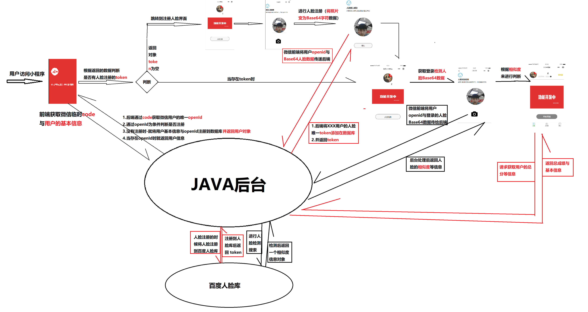
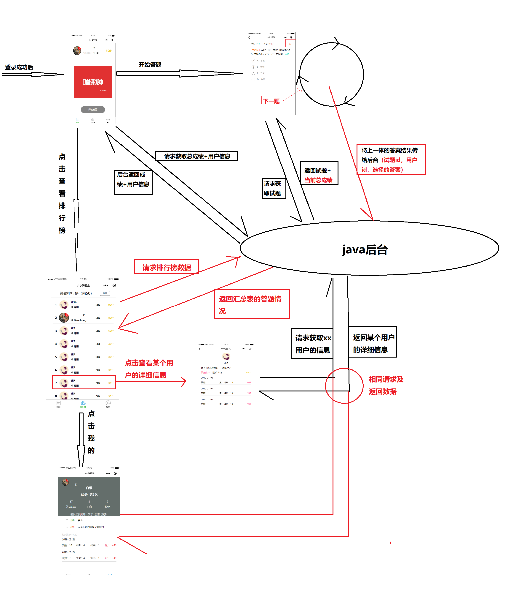

---

---

# examinationv2

#### 介绍

	答题宝后端API开发

#### 项目目录结构
| 序号 | 目录         | 用途                                            |
| ---- | ------------ | ----------------------------------------------- |
| 1    | pom.xml      | jar包引用                                       |
| 2.   | READAM.md    | 说明文档                                        |
| 3.   | commons 包下 | 公共代码及工具                                  |
| 4.   | conf 包下    | 为Swagger的API可视化插件                        |
| 5.   | eaxm 包下    | 用户答题操作代码                                |
| 6.   | user         | 微信用户注册（人脸注册）登录（人脸检测）API代码 |


#### 安装教程

 编译打包：

	添加maven的package任务， 一般是clean package
	同时添加虚拟机参数，忽略测试任务：-Dmaven.test.skip=true

#### 使用说明

	运行 java -jar xxx.jar [--spring.profiles.active=local --server.port=8080](可选)
	
	查看API: 
		1. 运行（ExamV2WebApp.java）项目启动
		2. 浏览器输入 http://127.0.0.1:8080/swagger-ui.html  查看对象接口即说明文档

#### 导包说明

1. 在pom中加上启动类

```xml
<!-- 导包配置 -->
<build>
	<plugins>
		<plugin>
			<groupId>org.springframework.boot</groupId>
			<artifactId>spring-boot-maven-plugin</artifactId>
			<configuration>
				<maimClass>cn.xiaox.WebApp</maimClass>
			</configuration>
			<executions>
				<execution>
					<goals>
						<goal>repackage</goal>
					</goals>
				</execution>
			</executions>
		</plugin>
	</plugins>
</build>
```

2. 打jar包时
   1. 使用mvn celan  package 打包
   2. 使用java –jar 包名

```

```

3. 打war包时
   1. 先修改启动类

```java
@SpringBootApplication
@EnableAutoConfiguration
public class WebApp extends SpringBootServletInitializer {

    public static void main(String[] args) {
        SpringApplication.run(WebApp.class, args);
    }

    @Override
    protected SpringApplicationBuilder configure(SpringApplicationBuilder builder) {
        return builder.sources(WebApp.class);
    }
}   
```

​		2. 在pom.xml添加（选择）

```xml
<dependency>
		 <groupId>javax.faces</groupId>
		 <artifactId>javax.faces-api</artifactId>
		 <version>2.3</version>
		 <scope>provided</scope>
</dependency>
```

​		3. 要将内置的tocamt关闭

```xml
<dependency>
		<groupId>org.springframework.boot</groupId>
		<artifactId>spring-boot-starter-tomcat</artifactId>
		<!-- war包需要 -->
		 <scope>provided</scope>
</dependency>
```

​		4. 使用mvn celan package 打包

​			1. 将war包 放入到tomcat webapps下运行即可

 

#### springBoot整合日志

​		1. 导入lombok jar，在pom文件中添加

```xml
<!-- SpringBoot 对lombok 支持 -->
		<dependency>
			<groupId>org.projectlombok</groupId>
			<artifactId>lombok</artifactId>
		</dependency>
```

​		2. 编写配置文件

```yml
#版本1  application-local.yml
sys:
  version: 0.2.1

server:
  tomcat:
    accesslog:
      enabled: true
      directory: C:/Users/beiie-fille/Desktop/ss/logs/hello/yml
      pattern: '%h %l %u [%{yyyy-MM-dd HH:mm:ss.SSS}t] "%r" %s %b %D'
      prefix: hello_access
      suffix: .log
    basedir: C:/Users/beiie-fille/Desktop/ss/logs/hello/yml

#指明要打印debug的包
logging.level.cn.xiaox.controller: DEBUG
#主要当部署war包时要将日志路径改为www/wwwroot/....
```

```yml
      
      ```application.properties
      #版本2 application.properties
      sys.version=0.2
      
      # spring.profiles.active=local
      
      server.tomcat.accesslog.enabled: true
      server.tomcat.accesslog.directory: C:/Users/beiie-fille/Desktop/ss/logs/hello
      server.tomcat.accesslog.pattern: '%h %l %u [%{yyyy-MM-dd HH:mm:ss.SSS}t] "%r" %s %b %D'
      server.tomcat.accesslog.prefix: hello_access
      server.tomcat.accesslog.suffix: .log
      server.tomcat.basedir: C:/Users/beiie-fille/Desktop/ss/logs/hello
```

​		3. 给ide安装lombok插件
```yml
-javaagent:C:\RJ\eclipse_ee_2019\lombok.jar
/* 在的eclipse安装目录下修改 eclipse.ini 在最后一行加上上面一行 */
/* 注意：-javaagent:后面加的jar的位置（最好将jar放在安装目录下） */
```


#### SpringBoot与Swagger

​		1. pom.xml引入jar文件

```xml

  		<dependency>
             <groupId>io.springfox</groupId>
             <artifactId>springfox-swagger2</artifactId>
             <version>2.2.2</version>
          </dependency>
          <dependency>
             <groupId>io.springfox</groupId>
             <artifactId>springfox-swagger-ui</artifactId>
             <version>2.2.2</version>
          </dependency>
          <!-- 可能还需要下面这个jar（选择） -->
          <dependency>
	        <groupId>javax.xml.bind</groupId>
	        <artifactId>jaxb-api</artifactId>
	    </dependency>
```

​		2. 编写一个配置类SwaggerConfig.java

```java
  package cn.xiaox.config;
  
  import org.springframework.beans.factory.annotation.Value;
  import org.springframework.context.annotation.Bean;
  import org.springframework.context.annotation.Configuration;
  
  import springfox.documentation.builders.ApiInfoBuilder;
  import springfox.documentation.spi.DocumentationType;
  import springfox.documentation.spring.web.plugins.Docket;
  import springfox.documentation.swagger2.annotations.EnableSwagger2;
  import static com.google.common.base.Predicates.or;
  import static springfox.documentation.builders.PathSelectors.regex;
  
  @Configuration
  @EnableSwagger2
  @SuppressWarnings("unchecked")
  public class SwaggerConfig {
  	@Value("${sys.version}")
  	private String systemPublish;      
  	
  	@Bean
          public Docket testApi() {
              return new Docket(DocumentationType.SWAGGER_2)
                      .groupName("考试相关API")
                      .pathMapping("/")
                      .select()
                      .paths(or(regex("/v1/user/question/.*")))//过滤的接口
                      .build()
                      .apiInfo(new ApiInfoBuilder()
                              .title("考试相关API")
                              .version(systemPublish)
                              .build());
          }
      
      @Bean
      public Docket baseApi() {
          return new Docket(DocumentationType.SWAGGER_2)
                  .groupName("基础服务相关API")
                  .pathMapping("/")
                  .select()
                  .paths(or(regex("/v1/open/base/.*")))//过滤的接口
                  .build()
                  .apiInfo(new ApiInfoBuilder()
                          .title("基础服务相关API")
                          .version(systemPublish)
                          .build());
      }
  }    
```

​		3. 注解说明

  ```html
  说明：
  
  @Api：用在类上，说明该类的作用
  @ApiOperation：用在方法上，说明方法的作用
  @ApiImplicitParams：用在方法上包含一组参数说明
  @ApiImplicitParam：用在@ApiImplicitParams注解中，指定一个请求参数的各个方面
      paramType：参数放在哪个地方
      header-->请求参数的获取：@RequestHeader
      query-->请求参数的获取：@RequestParam
          path（用于restful接口）-->请求参数的获取：@PathVariable
          body（不常用）
          form（不常用）
          name：参数名
      dataType：参数类型
      required：参数是否必须传
      value：参数的意思
      defaultValue：参数的默认值
  @ApiResponses：用于表示一组响应
  @ApiResponse：用在@ApiResponses中，一般用于表达一个错误的响应信息
      code：数字，例如400
      message：信息，例如"请求参数没填好"
      response：抛出异常的类
  @ApiModel：描述一个Model的信息（这种一般用在post创建的时候，使用@RequestBody这样的场景，请求参数无法使用@ApiImplicitParam注解进行描述的时候）
  @ApiModelProperty：描述一个model的属性
  ```

​		4. 访问及注意

  ```
  启动服务，浏览器输入"http://localhost:8080/swagger-ui.html
  
  注意：更多参考其它文档
  ```
#### 功能分析

1. 登录注册考试包



2. 答题功能分析



#### 项目作者

​	xiaoandx.周巍

#### 版本

​	V2

#### 更多项目

​		<https://gitee.com/xiaoandx_my/ProjectRainbow>